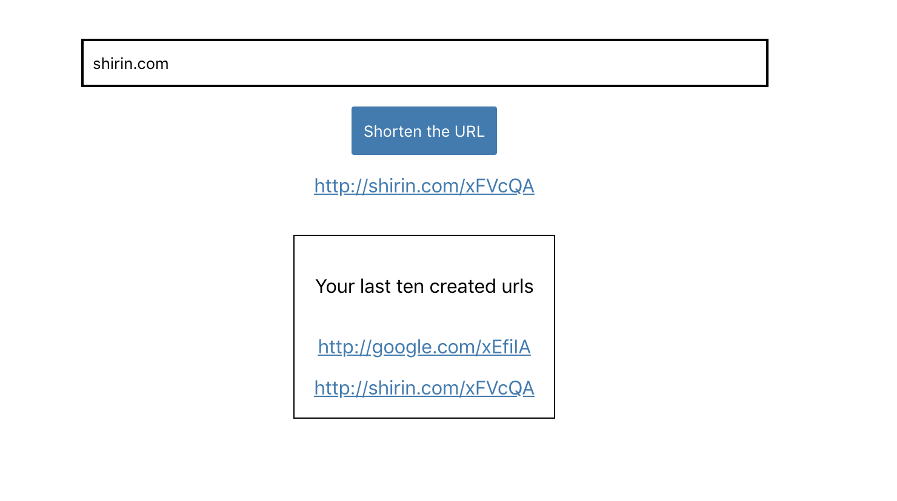

## Tiny urls project

This project was bootstrapped with [Create React App](https://github.com/facebook/create-react-app) and has been built by React framework.
In this project, it is possible to type a url as an input and then see a shortened Url as an result. It means if a very big url is entered, it makes it short and more readable. In addition, the last ten input urls are saved in sessionStorage as 'url' and they can be used whenever needed.

## Available Scripts

In the project directory, please first run 'npm install'. Then you can run following commands:

### `npm start`

Open [http://localhost:3000](http://localhost:3000) to view it in the browser.

The page will reload if you make edits. 
You will also see any lint errors in the console.

### `npm test`

Fisrt run "yarn add --dev react-test-renderer" and then you can run "npm test"
